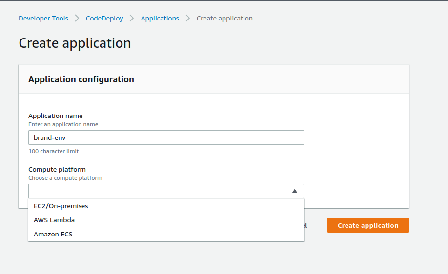

## INTRODUCTION

This Document, explains about the steps that need to follow for OriServe application setup.

In this Doc,
- Bucketname : manjeet-test-ori
- BrandName: likith
- environment: Dev 
- Modify the above values based on your brand.Above details are only for reference.

## S3 BUCKET Modifications

- Create the new brand under a reference bucket with appropriate nomenclature.
- Copy the existing brand files in to new brand.
- For Ex: Here newly created brand is `likith` under the reference bucket `manjeet-test-ori`. Copied the brand files from `pd1` (you can do it from any brand)
- Download the `OCS` env from the bucket location `/manjeet-test-ori/likith/Apptier/Environment/Development/` and modify the below details according to your brand configuration and revert back to S3 same location.
    - SERVER_URL: brand-environment.oriserve.com
    - CS_DB_USERNAME:
    - CS_DB_PASSWORD:
    - BrandName: 
- Download the `Users` env from the bucket location `/manjeet-test-ori/likith/Users/Environment/Development/` and modify the below details according to your brand configuration and reupload to the S3 same location.
    - BrandName:
    - MONGODB_USERNAME:
    - MONGODB_PASSWORD:
- Download the `Schedulers` env from the bucket location `/manjeet-test-ori/likith/Schedulers/Environment/Development/` and modify the below details according to your brand configuration and reupload to the S3 bucket: 
    - BrandName:
    - MONGODB_USERNAME:
    - MONGODB_PASSWORD: 

- Modify the env file at location `manjeet-test-ori/likith/WebTier/Environment/Development/` public url as your OCS url i.e, `likith-dev-oriserve.com/chatbot`
- Modify the Dashboard env file at location `manjeet-test-ori/likith/WebTier/Environment/Development/Dashboard/` "BASE_URL & SOCKET_URL".

## AWS CONFIGURATION

- Create an instance for your brand of respective service with an instance type "t3a.small" (only for reference) with a nomenclature `brand-environment-Stack`.
- Ex: `tvs-dev-Fullstack`
- Make sure that created instance should have the below inbound rules and outbound rules as "ALL"

- Go to the `AWS Route53` and select the zone `oriserve.com`.
- Create DNS records for chatbot and dashboards for  your brand. Below SS is for your reference.
- For OCS: `brand-environment.domainname`
- For Dashboard: `brand-environment-dashboard.domainname`
- For Dashboard2: `brand-environment-dashboard2.domainname`

- Create an IAM role with the `AWSCodeDeployRole`.
- Now, go to the `AWS CODEDEPLOY` service and create an application for your brand with the nomenclature of brand-environment.Below SS is for your reference.Choose the `EC2/On-premises` as compute platform in below image.

- After successfully creating the applicaion, create the DeploymentGroup for your each service with the nomenclature of `environment-service-DeploymentGroup`. Please take the below image as reference.

- Give the deployment group as above nomenclature.Under service role, select the created IAM role.

- Under Environment configuration, select the EC2 instances, and select the instance thats on to deploy.
)
- Make sure that the `AWS Code Deploy Agent` is selected `Never` uncheck the `Load balancer` option. Create the DeploymentGroup.
- Follow the same procedure for every service.

## SERVER CONFIGURATION

- Log into the server using terminal for further process.
- nginx config file location: `/etc/nginx`
- Path at which code is stored: `/var/node/apps`
- Path at which the services config files: `/etc/nginx/config.d`
- Get the `nginx.conf` and `error.conf` files from the `/manjeet-test-ori/likith/WebTier/Environment/Development/nginx/` to nginx config location on the server.
- Get the config files of OCS,Dashboard,Dashboard2 from the `/manjeet-test-ori/likith/WebTier/Environment/Development/config.d` into the service config path.
- Generate the ssl certificates using cert-bot by using below command:

        sudo certbot -d brand-environment-service.oriserve.com --nginx
         Ex: sudo certbot -d likith-dev.oriserve.com --nginx
- Verify by browsing your domain.
- We use MongoDb, redis, RabbitMQ as our database through docker container.
- Get the below commands by to run the databases:

            sudo docker run -d --name mongoDB -v /home/ec2-user/new-mongo-data:/data/db -p 27017:27017 mongo:3.6 --auth
            sudo docker run --name redis -p 6379:6379 -d redis redis-server --requirepass redispass
            sudo docker run -d --hostname rabbitDemo --name rabbitDemo -e RABBITMQ_DEFAULT_USER=demorabbitori -e RABBITMQ_DEFAULT_PASS=kmVng7CGzCKZXuivFwhIKirViHTNQ1_c -p 5672:5672 -p 15672:15672 rabbitmq:3-management

- Lets see how to connect to the database (mongoDB) that you installed on the server using docker.
- Now, you can connect your db as follows.
- We use `Nosqlbooster` which is an GUI tool to connect with the DB. you can download from the [Nosqlbooster](https://nosqlbooster.com/downloads)
- Format of the URI to connect to DB is `mongodb://dbusername:dbpass@IP:27017/dbname?authSource=dbname`. Change the details according to the project.
- After modifying the URI, go to Nosqlbooster, 
- Top right you can see an option `connect` click on it, it will prompt you an dashboard to selecto the method to connect.
- Select the `FromURI` option and paste your URI (if you copied the URI, mostly automatically it will paste. If not paste manually) and click connect to connect to your database.

## CODE LEVEL CHANGES

- Before configuring the jenkins and building it , Now we will see the changes that are needed to be done at code level for dashboard,dashboard2 and chatbot.
- Clone the repository into your local.Let's say `chatbot-dashboard` repository.
- Create the new branch with an appropriate nomenclature by using the command :

            `git checkout -b <branch namae>`

- Modify the data of `export const BASE_URL_USERS`,`export const BASE_URL`,`export const BASE_SOCKET_URL` in location `src/data/config/urls.js` to your brand OCS url. Here, the brand ocs url is `likith-dev.oriserve.com` (this is the address to which our request will redirect to))

- The result for this will show at the end of the document.
- Push the newly updated code to the respective repository under newly created branch. 
- FOR `chatbot-2.0`
Modify the data `export const socketUrl` to your OCS url. SS for your reference. 
## JENKINS CONFIGURATION

- Copy the Jenkins Job from the existing brands for reference as `environment-brand-service` Ex: dev-likith-ocs.
- Lets say we are configuring the `chatbot-dashboard`.
- Under source code management, change the newly created branch, from where it fetch the code.
- In each job configuration, under build section, modify the Shell with your respective bucket and brand in place of `manjeet-test-ori` and `likith`.Below image for your reference.
- For Dashboard service.
.
- For chatbot service

- For Users service,

- Under POST-BUILD section modify the following details as per your Brand configuration.
    - Env file location
    - CodeDeploy Application
    - CodeDeploy DeploymentGroup
    - AWS region
    - S3 bucket
    - S3 prefix

- Chatbot shell configuration, modify the `S3 URI` path as per your brand.

- Users shell configuration, modify the `S3 URI` path as per your brand.

- Build the each job and first time it will get fails.
- Now, start the PM2 process on server as follows.
- PM2 - PM2 is an process manager for Node.js applications that has a in built load-balancer. PM2 enables you to keep  applications alive forever,reloads them without downtime.
- Go to the path `/var/node/apps/ocs` and run the below command.
    - `pm2 start --name ocs-8080 npm -- start`
- Go to the path `/var/node/apps/users` and run the below command.
    - `pm2 start --name users-8087 npm -- start`
- Go to the path `/var/node/apps/scheduler` and run the below command.
    - `pm2 start --name scheduler-5000 npm -- start`

- Build the Job again and wait untill it gets success.
- Browse the OCS url, Dashboard, Dashboard2 url.

- Make sure that the backend listener should be the same brand service.