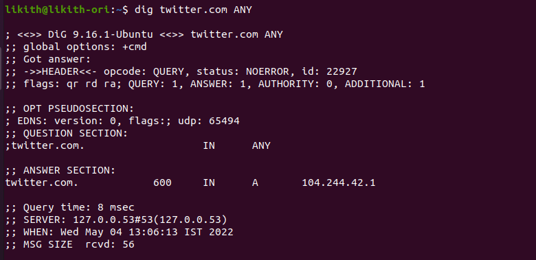

### INTRO

- The dig command in Linux is used to gather DNS information

- `dig` Domain Information Groper, and it collects data about Domain Name Servers.
- It is helpful for troubleshooting DNS problems,

#### DIG syntax

`dig [server] [name] [type]`

- [server] – The hostname or IP address.
- [name] – The DNS Name.
- [type] – The type of DNS record to retrieve.

### dig usage

Below are the some examples how to use `dig` command.

#### DNS Lookup

command: `dig twitter.com`

#### I.P address

- To display the I.P address, associated with the Domain

commad : ` dig twitter.com +short`

#### Reverse DNS Lookup

- To display the domain nameby it's IP address.

command : `dig -x 172.217.14.238`
