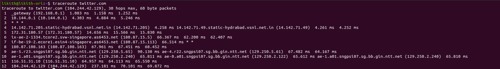
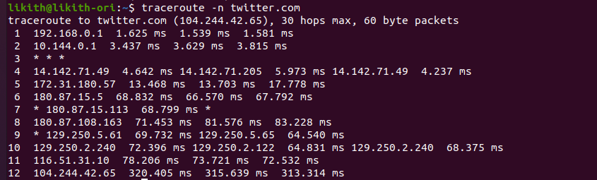
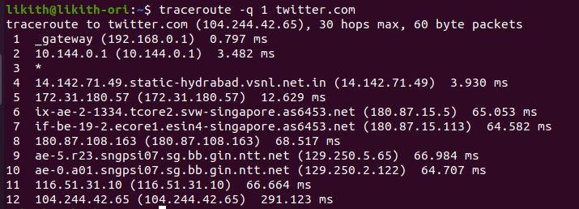
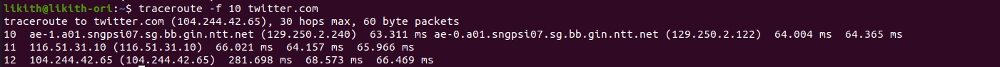

### INTRO

- `traceroute` is the linux command that prints the route that a packet takes to reach the host.
- Used to show the route data packets take.
- traceroute not only pings the final destination, it also pings each router on its way to the destination.
- `traceroute` command is much similar to the `ping` command.
- The main difference between is,
  - `Ping` command is used to check if a particualar IP address is accessible or not. It works by sending a packet to the destination of the domain name. It also measures the round trip time.
  - `traceroute` command will show the number of steps(hops) required to reach the destination. It will also show the time lapse of each step.
- Measures the round trip time.
- Traceroute can pinpoint where the problem lies.
- `traceroute` is not a default utility of the linux system. To use the traceroute, we need to install it manually. To install, use the below commands.
  - `sudo apt install inetutils-traceroute`
  - `sudo apt install traceroute`

#### Terms need to know

- `hops` - The journey from one computer to another.
- `TTL` Time to Live.

### WHEN TO USE

- `traceroute` command can be used when troubleshooting possible connection issues to website.
- When a website/domainname is not reachable, we will use the traceroute command.
- Sometimes, the website is running and healthy, situation, due to the breakdown of the intermediate routers website can't be accessed.
- In these case, we can use the `traceroute` to check at which step the request has taking the break.

### Using tranceroute

- command: `traceroute twitter.com`

- From above, we can see that there are 12 hops/stages between our computer and the twitter website/destination.
- In first line, you can see the I.P address of the twitter.
- From next line, you can see the HOPS.
- The format of the each HOP line as follows.
  - The name of the device.
  - The I.P address.
  - The time it took round trip for each of the three tests.

### Hiding devic names

- Sometimes, it is tedious to analyse using with device names. To make it easier, use below command to hide the devices names.
- command : `traceroute -n twitter.com`

### Setting the Number of Tests

- By default, traceroute sends three packets to each hop. We can use the `-q` flag to increase or decrease.
- command: `traceroute -q 1 twitter.com`

### TTL option

- If we need to check only from certain hops, we can filter the hops requests as follows.
- command: `traceroute -f 10 google.com`

### Port changing

- By default, traceroute uses the 33434. But sometimes, website that we trying to access