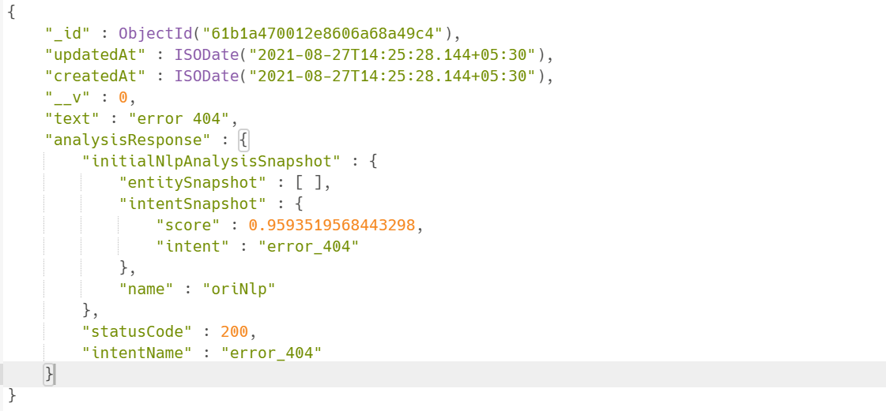
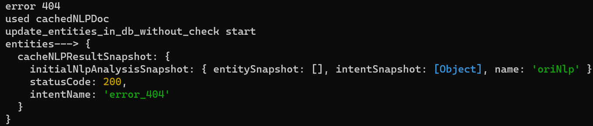

# **CacheNLPResponse**

## Overview

The idea behind this is to create a local cache for utterances such that we need not to hit the NLP Server Everytime and to identify things that are difficult to understand from AI.  


------
- **Field in cacheNLPResponse:**

        {
            "_id" : ObjectId("61f274dc66d4461fdd645309",
            "updatedAt" : ISODate("2021-08-27T14:25:28.143+05:30"),
            "createdAt" : ISODate("2021-08-27T14:25:28.143+05:30"),
            "__v" : 0,
            "text" : "book test ride",
            "analysisResponse" : {
                "initialNlpAnalysisSnapshot" : {
			        "entitySnapshot" : [ ],
			        "intentSnapshot" : {
				        "score" : 0.9593519568443298,
				        "intent" : "book_test_ride"
			        },
			        "name" : "oriNlp"
		        },
		        "statusCode" : 200,
		        "intentName" : "book_test_ride"
            }
        }

------

## How to add document in cacheNLPResponse 

* Go into the collection named cacheNLPResponse in DB and click on Add document.

<!--  -->

* Enter the text and the intent for which you want to map it to.  

<!--  -->

```javascript
    db.getCollection("cacheNLPResponse").insert({
        "updatedAt": ISODate("2021-12-13T12:15:51.065+05:30"),
        "createdAt": ISODate("2021-12-13T12:15:51.065+05:30"),
        "__v": 0,
        "text": "recharge",
        "analysisResponse": {
            "initialNlpAnalysisSnapshot": {
                "entitySnapshot": [],
                "intentSnapshot": {
                    "score": 0.9593519568443298,
                    "intent": "recharge"
                },
                "name": "oriNlp"
            },
            "statusCode": 200,
            "intentName": "recharge"
        }
    })
```
* The <b>key “text” </b>contains the <b>predefined text</b>, here we write the text for which we want to trigger the intent.<br/> Ex: for "recharge" intent we can put text as “recharge”.

* The <b>key “intent”</b> inside intentSnapsot and the key “intentName” is where we put our <b>intent’s name </b>which we want to trigger. 
    <br/> Ex: “recharge”	can be put up here. 

* The <b>key “score” </b>inside “intentSnapshot” represents the <b>probability</b> with which the <b>match </b>happened, it is mainly like a virtual representation of how a match happen with AI. 
    <br/> Ex: in case of AI, a text matches to an intent with some probabilty so we put this no here as to depict the probabilty of the match for out text to intent.    

------

## Use case
* To create a local cache in order to avoid hitting the NLP Server for every text.
* To map complex text, to an intent which is hard to understand by NLP. 

------

## Working
**Head to branch ```product-testFinal1```**

**File name - ```../ori-communication-service/BrainService/BrainService.js```**

* **User message analysing function** [function name - **```analyzeUserMessage```**]
    * It analyses the message entered by the user
     
     ```javascript
    async function analyzeUserMessage(socket, serviceName, userData, session_doc, isHeartbeat = false) {
    try {
        return new Promise(async (resolve, reject) => {
            .
            .
            if (process.env.cacheNLPResponse === 'true'){
                const canchedNLPDoc = cacheNLPResponses.find(o => (o.text === userText));
                if (canchedNLPDoc && canchedNLPDoc.analysisResponse) {
                    console.log("used cachedNLPDoc")
                    if (canchedNLPDoc.analysisResponse.initialNlpAnalysisSnapshot) {
                    canchedNLPDoc.analysisResponse.initialNlpAnalysisSnapshot.name = NLP_SERVICE_NAME;
                    }
                    session_doc = await update_entities_in_db_without_check(session_doc, {
                    cacheNLPResultSnapshot : canchedNLPDoc.analysisResponse
                    });
                    return resolve(_.cloneDeep(canchedNLPDoc.analysisResponse));
                }
            }
        }        
        .
        .
        .
    }        
    ``` 
    - When a user enters a text, analyzeUserMessage function tries to find a exact match where the text is same to as user entered in the cacheNLPResponse collection. And if it finds a match then the intent mentioned inside the analysisResponse is triggered.
    - cacheNLP match is only checked if the field named "cacheNLPResponse" in .env file is true. 

------

## Result

- Entry in Database


- Result when user wrote the same text


- Here we see that the intent got triggered from the cacheNLPResponse. 
<!-- <figcaption>Logs</figcaption> -->


------

## Drawback
* The drawback in this is that it only works when the string is exactly same as the text in cacheNLPResponse, one extra space can also cause it to dismatch. 

     
 

    