## What is Bot Messages ?

 It is a simple message by which BOT responds to a user's query. 

  * There can be multiple ways through BOT responds known as 
  types of bot messages.

  * Here in this picture user tries to say "hi" to the BOT and BOT
  respond with a simple text message starting with Hello! Welcome
  to Amity University Jaipur.

  * There is also a message down next to Hello Response. (This 
  contains text along with buttons that will be covered later.)


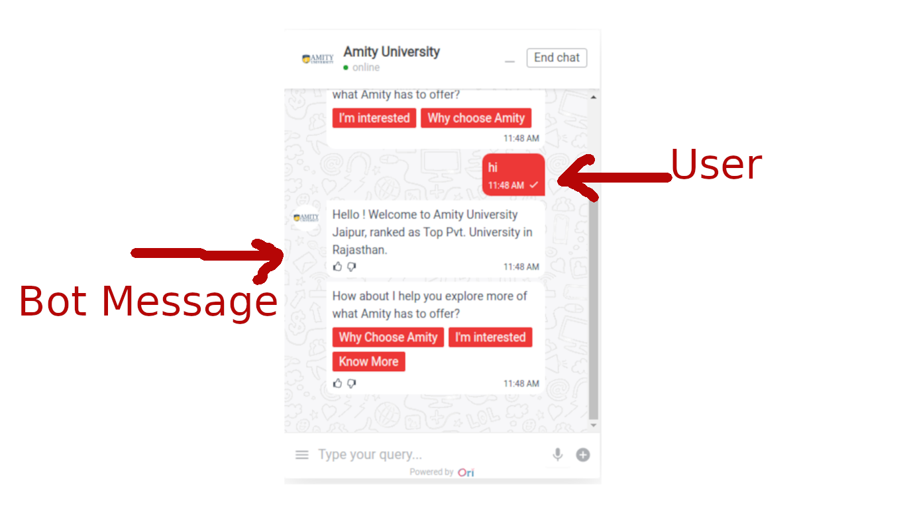

## Types of BOT Messages
- Text
- Text with Buttons
- Images with Buttons
- Carousal
- Video
- Form
- Menu
- Checkbox
- Custom Messages (Actually, it is a kind of Message but we will see it along with
 other messages.)


## Where can I create these messages ?

Just open the dashboard and follow steps as shown in this video 📽

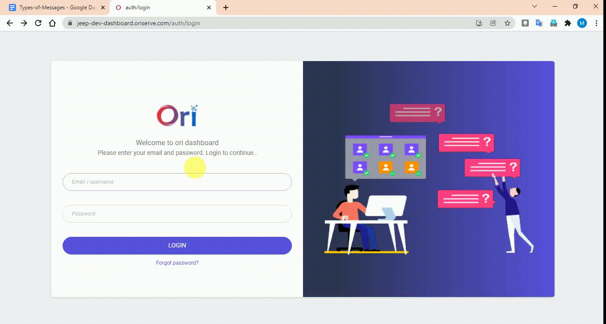


## Common properties for all the messages that we be create from Dashboard as well as through

* ### text
A simple text that we want to show in message

* ### title
This is more like text. But since it is the title , that's why by default it will be in bold. compared to other texts.

* ### subtitle
This is normal text but it will not be in bold.

* ### variable_name
   In this variable user response is saved. And will be immediately saved inside DB
Where to find this ? 
-> Inside DB 
-> Go to chat_sessions collection 
-> Inside this, open current document 
-> Then inside this goto context_variables 
-> Inside this you will have your variable_name with value

* ### skipLS 
Full name Skip Language Service.
As the name suggests, do not perform anything related to catching what the user wants to say(intention).

  * use case :
    - Whenever we want to get plain text from a user and to not to be recognised as user's intent by AI.


* ### input_lock :
Whether we want to lock the input field or not where user types

* ### send_variable_to_apiai:
Whatever variable attached with any particular message. if the user responded to that message. User response will be stored to a variable and this is sent to AI if we set custom_message_doc.send_variable_to_apiai = true;.otherwise if it is false then variable will not be sent to AI.

* ### delay:
After how much time we want this message to be displayed (must be in milliseconds)

* ### action_before:
Same as we saw this like in the case of Dashboard.
we can trigger a function just before displaying the message. And we do some pre work in that function.

Once this function resolves its purpose the message will be displayed.

```js

const buyOnlineButtonFunction = async (socket, session_doc) => new Promise(async (resolve, reject) => {
   try {
      //function body	
 
      // return resolve(session_doc); // if your task resolved
      // return reject(session_doc); // if your task failed
   } catch (error) {
       console.error(error);
       handleAppError({ error });
   }
});

```


* ### buttons: 
Do you want to add buttons with your message with full customization ?

Do this to add buttons along with your message in code


```js
custom_message_doc.buttons = [
  {
    "text": "Button 1",
    "type": "default",
  },
  {
    "text": "Button 2",
    "type": "link",
    "url": "https://www.jeep-india.com/bmo-page.html#/vehicles"
  },
  {
    ... // add as many button you want in similar fashion 
  }
];

```

:::tip
will see later how you can add buttons from Dashboard
:::

## How many types of buttons can we create ?
1. #### Default Button
   - A simple button after pressed by user it will sent response on behalf of user

2. #### Link Button
   - After clicking over this button a user will be redirected to given link in this button

3. #### customSocketEvent
   - A fully featured button type we can do so many things with this in place.

     - We can pass additional data into this type of button
        ```js
        {
			"text" : "Your text",
			"type" : "customSocketEvent",
			"eventName" : "buttonSelection",
			"relayData" : {
				yourkey: yourvalue
                ... add anything that you needed
			}
		},
        ```

     - We can trigger a specific intent when user clicks over this button
        ```js
        {
			"text" : "Your text",
			"type" : "customSocketEvent",
			"eventName" : "buttonSelection",
			"relayData" : {
				relay_intnet: "your_intent_name"
			}
		},
        ```
     - We can trigger a specific workflow when user clicks over this button
        ```js
        {
			"text" : "Your text",
			"type" : "customSocketEvent",
			"eventName" : "buttonSelection",
			"relayData" : {
        relay_wid : 100,
        relay_next_node : 1
			}
		},
        ```

:::tip Tip Time

- Text
- Text with Buttons
- Images with Buttons
- Carousal
- Video

These Messages can be directly created from Dashboard as well as from Code Level.
But Recommended way is Dashboard. (only if there is no dynamic content we have to send)

:::

## Text

### Creating Text Message From Dashboard
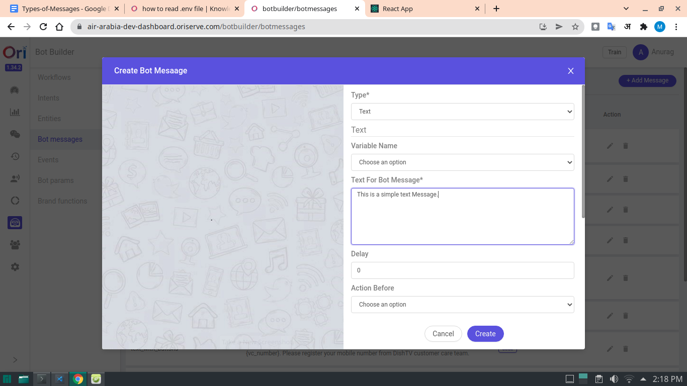


:::tip Do you want to create dynamic message right from your Dashboard

While creating Text message give text something like this

```
  Hello! My name is {user_name}. I am from {country_name}. 
```

Do you know what will do this

At the time of execution of this message. If your context variable contains "user_name" or "place_name" property then these variables wrapped inside curly braces. Automatically gets populated with that value.

And Finally you will see that your message have text something like down below

```
  Hello! My name is Mrityunjay Kumar. I am from India.
```

:::

### Creating Text Message From Code:

```js
// get the id from DB of the particular message that we created from Dashboard
// (you can find it from -> inside DB -> messages collection)
session_doc = await genAndSendResponse(socket, session_doc, 'response', '61f62ec53af6cf4b8dd71c22');


// our own custom message

let custom_message_doc = {};
custom_message_doc.type = "text"; // type required of course
custom_message_doc.text = "Below are nearest dealership based on your location"; // required
custom_message_doc.send_variable_to_apiai = false;
custom_message_doc.skipLS = true;
custom_message_doc.variable_name = "hasDealer";
custom_message_doc.input_lock = false;

session_doc = await genAndSendResponse(socket, session_doc, 'response', null, custom_message_doc);

```

#### Output

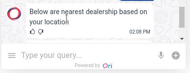

## Text with Buttons

### Creating "Text with Buttons" Message from Dashboard

* Enjoy this video

<!-- works well with youtube videos or online public video link -->
<!-- <iframe src="" frameborder="0" allowfullsreen width="100%" height="400">
</iframe> -->

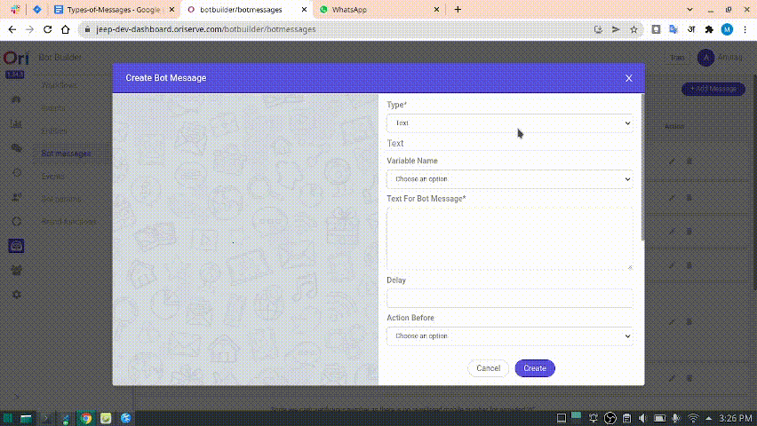

* And yes don't forget to click over create button. 😂

### Creating "Text with Buttons" Message from Code Level

```js
let custom_message_doc = {}
   custom_message_doc.type = "text_with_buttons";
   custom_message_doc.subtitle = "Follow this link for your online booking."; // required field
   custom_message_doc.title = "";
   custom_message_doc.send_variable_to_apiai = false;
   custom_message_doc.skipLS = false;
   custom_message_doc.inputLock = false;
   custom_message_doc.text = "Follow this link for your online booking.";
   custom_message_doc.buttons = [
     {
       "text": "Button 1",
       "type": "default",
     },
     {
       "text": "Button 2",
       "type": "link",
       "url": "https://www.jeep-india.com/bmo-page.html#/vehicles"
     },
     {
      ... // add as many button you want in similar fashion 
     }
   ];
 
   session_doc = await genAndSendResponse(socket, session_doc, 'response', null, custom_message_doc);

```

- Here, one noticeable point is that we must add subtitle property.


:::danger TAKE CARE
If your subtitle contains HTML or your text contains HTML do not forget to add these lines of code

```
   custom_message_doc.containsHtmlSubtitle = true; (must use, if subtitle contains html)
   custom_message_doc.containsHTML = true; (must use, if text contains html)
```
:::

#### Output
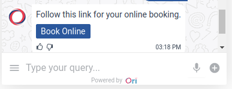


## Image With Buttons

### Creating "Image With Buttons" Message from Dashboard

* Enjoy this video

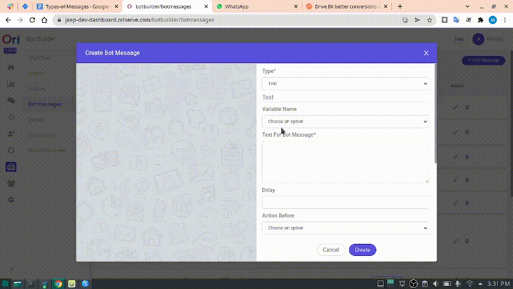

### Creating "Image With Buttons" Message from Code Level

```js
let custom_message_doc = {}
   custom_message_doc.type = "image_with_buttons";
   custom_message_doc.subtitle = "Follow this link for your online booking.";
   custom_message_doc.imageUrl = "https://knowledge-dev.oriserve.com/img/ori-logo.png";
   custom_message_doc.title = "";
   custom_message_doc.send_variable_to_apiai = false;
   custom_message_doc.skipLS = false;
   custom_message_doc.inputLock = false;
   custom_message_doc.text = "Follow this link for your online booking.";
   custom_message_doc.containsHtmlSubtitle = true;
   custom_message_doc.containsHTML = true;
   custom_message_doc.buttons = [
     {
       "text": "Button 1",
       "type": "default"
     },
     {
       "text": "Button 2",
       "type": "link",
       "url": "https://www.jeep-india.com/bmo-page.html#/vehicles"
     }
   ];
 
   session_doc = await genAndSendResponse(socket, session_doc, 'response', null, custom_message_doc);

```

:::tip wait, what has changed here ?
As we showed in text_with_buttons, here we are adding an image so for that we need to include the image along with the image's link.

:::

#### Output

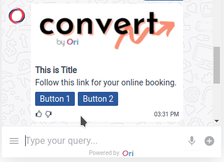


## Carousel

### Creating "Carousel" Message from Dashboard

* Enjoy this video

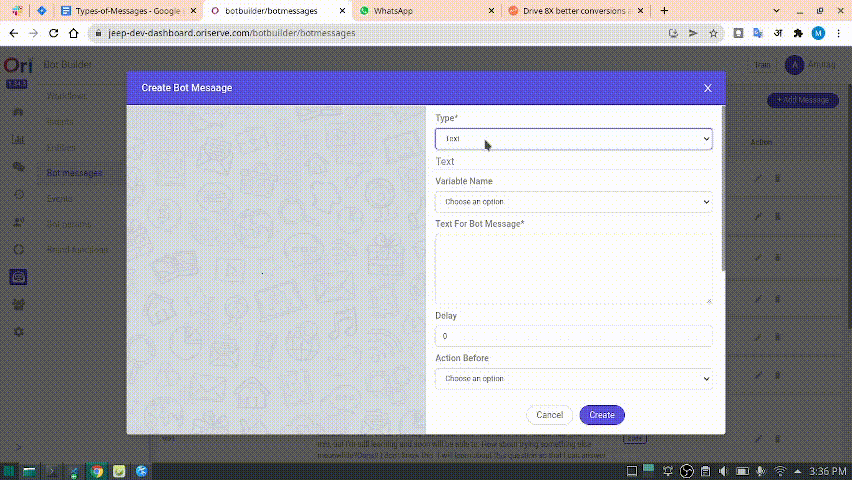

### Creating "Carousel" Message from Code Level

- This carousel message is more like sliders. In each slider we can have
image
   - n number of buttons
   - Title
   - Subtitle

### Where can I use this ?
suppose you are working on a workflow and you need to show the multiple cities to user for selection.
you can use this 


```js
const custom_message_doc = {};
   custom_message_doc.type = 'carousel';
   custom_message_doc.title = '';
   custom_message_doc.subtitle = "";
   custom_message_doc.send_variable_to_apiai = false;
   custom_message_doc.variable = '';
 
   custom_message_doc.options = [{
     optionInfo: { key: 'order' },
     title: "I am title in carousel",
     subtitle: `<em>Image 1</em>`,
     mediaType: "image",
     mediaUrl: "https://raw.githubusercontent.com/mrityunjay-1/projects-images/main/weather-app-img-2.png",
     containsHtmlSubtitle: true,
     buttons: [
       {
         text: "Button 1",
         type: "default"
       },
       {
         text: "Button 2",
         type: "default"
       }
     ]
   }, {
     optionInfo: { key: 'order' },
     title: "i am title in carousel",
     subtitle: `Image 2`,
     mediaType: "image",
     mediaUrl: "https://raw.githubusercontent.com/mrityunjay-1/projects-images/main/weather-app-img-2.png"
   }, {
     optionInfo: { key: 'Mrityunjay kumar' },
     title: "i am title in carousel",
     subtitle: `Image 2`,
     mediaType: "image",
     mediaUrl: "https://raw.githubusercontent.com/mrityunjay-1/projects-images/main/weather-app-img-2.png"
   }];

```

#### Output
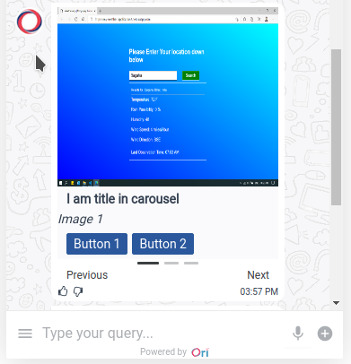


## Video Message

### Creating "Video" Message from Dashboard

* From dashboard it is easier to make. Did you try this one on your own? 

- Believe me it's way easier than you think.
  - Here are the Steps to follow:
    - You just have to select message type
    - Provide variable_name if you feel so
    - Provide Title, Subtitle
    - And lastly most importantly provide Video link
    - And you are done. So cool isn't it ?

* By the way enjoy this video
  
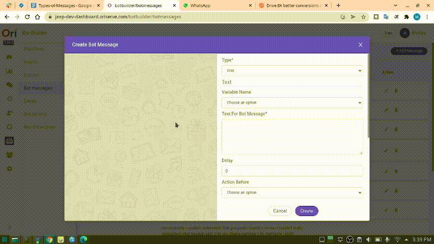

### Creating "Video" Message from Code Level

```js
  const custom_message_doc = {};
  custom_message_doc.type="video";
  custom_message_doc.title="I am title for video";
  custom_message_doc.subtitle="I am subtitle for video";
  custom_message_doc.send_variable_to_apiai = false;
  custom_message_doc.variable_name = "your variable";
  custom_message_doc.url = "http://examscuriosity.000webhostapp.com/projects/media/Zip_File.mp4";

  session_doc = await genAndSendResponse(socket, session_doc, 'response', null, custom_message_doc);
```


### Output
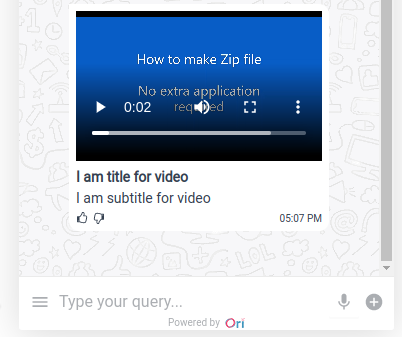


## Form

This message might not be available through Dashboard.

### Creating "Form" Message from Code Level

```js
const custom_message_doc = {};
custom_message_doc.type = 'form';
custom_message_doc.title = 'testing form type message';
custom_message_doc.formData = [
   {
       type: "radioGroup",
       title: "Passanger1",
       vertical: true,
       props: {
           name: "bag1",
           required: true,
           options: [
               { label: '80kg', value: '80kg' },
               { label: '12kg', value: '12kg' },
               { label: '15kg', value: '15kg' }
           ]
       }
   },
   {
       type: "radioGroup",
       title: "Passanger1",
       props: {
           name: "bag2",
           required: true,
           options: [
               { label: '80kg', value: '80kg' },
               { label: '12kg', value: '12kg' },
               { label: '15kg', value: '15kg' }
           ]
       }
   },
   {
       type: "radioGroup",
       title: "Passanger3",
       props: {
           name: "bag3",
           required: true,
           size: "small",
           buttonStyle: "solid",
           optionType: "button",
           options: [
               { label: '80kg', value: '80kg' },
               { label: '12kg', value: '12kg' },
               { label: '15kg', value: '15kg' }
           ]
       }
   }
]
 
session_doc = await genAndSendResponse(socket, session_doc, 'response', null, custom_message_doc)

Output means Data that comes as response to this message stored in context_variables stores as

// Output:
// "selectedData" : {
//     "bag1" : "80kg",
//     "bag2" : "12kg",
//     "bag3" : "12kg"
// }


```

#### Ouput
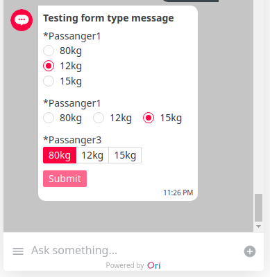

## Menu

This message might not be available through Dashboard.

### Creating "Menu" Message from Code Level

```js
custom_message_doc = {}
custom_message_doc.type = 'menu'
custom_message_doc.title = `Menu for your flight:`
custom_message_doc.subtitle = `Selecting for: <br>NOTE: As per your current package you can only select 1 free meal`
custom_message_doc.catalogueCategories = ['random', 'dish']  //category buttons like quick replies
custom_message_doc.freeCatalogue = false //boolean (if true then we can only select one item for that)
custom_message_doc.containsHtmlSubtitle = true
custom_message_doc.variable_name = 'mealButton'
custom_message_doc.submitText = "Continue"
custom_message_doc.catalogueData = [
   {
       "itemId": "CZWW", //required
       "itemName": "Chicken zinger wrap and water", //required
       "description": "Crispy breaded chicken breast with light Aioli sauce in wrap with water", //required
       "validations": [
           1
       ],
       "charges": [
           {
               "amount": 0,
               "chargeBasis": "PER_PASSENGER"
           }
       ],
       "additionalInfo": null,
       "inventory": null,
       "mealCategoryId": null,
       "mealCategoryCode": "Sandwiches and Wraps", //required
       "mealImagePath": "https://reservations.airarabia.com/images/meal_14339.jpg", //either this
       "mealThumbnailImagePath": "https://reservations.airarabia.com/images/meal_Thumbnail_14339.jpg", //or this is required
       "popularity": "100",
       "available": 300,
       "allocated": 300,
       "categoryRestricted": false,
       "quantity":1 //required -> this will be zero by default
   }
]
 
session_doc = await genAndSendResponse(socket, session_doc, 'response', null, custom_message_doc)
```

#### Output
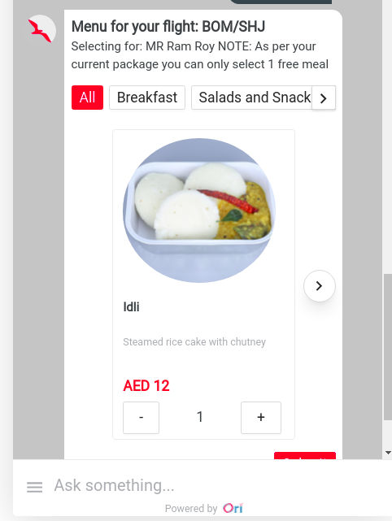


## Checkbox

### Creating "Checkbox" Message from Code Level

This message might not be available through Dashboard.

```js
const options = [
   { label: '0', value: 'checkbox option 1' },
   { value: '1', label: 'checkbox option 2' },
   { value: '2', label: 'checkbox option 3' },
 ]
 
const custom_message_doc = {}
custom_message_doc.type = 'checkbox_with_media'
custom_message_doc.title = "Do you want to make the same meal selection for other passengers as well? You need to select from the passenger list below."
custom_message_doc.imageUrl = ''
custom_message_doc.options = options
custom_message_doc.buttons = buttons
custom_message_doc.variable_name = 'checkboxButton'
custom_message_doc.submitText = "Continue"
custom_message_doc.quickReplies = quick_replies
 
session_doc = await genAndSendResponse(socket, session_doc, 'response', null, custom_message_doc)
```
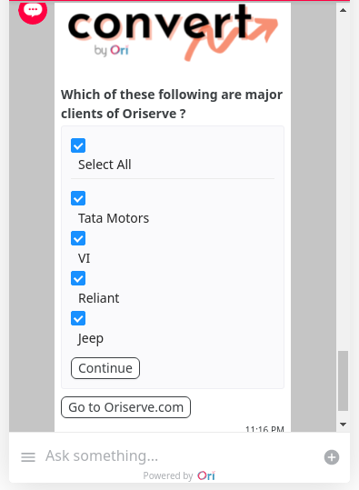


# FAQs

### How can i send messages created from Dashboard through our code ?
Whenever you are creating a message through dashboard it will be saved in Databases (obiviously). But here is the thing 

You have to get the _id of that particular message.

:::tip Where can i find the _id of that message ?

Open Database goto messages collection under that check your message that you created. copy the _id of that message.

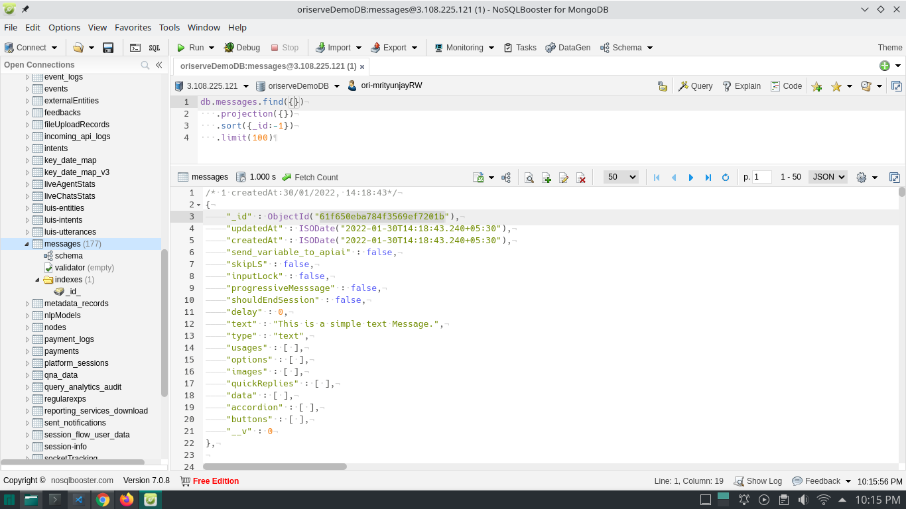

:::

```js
// include this line of code inside your function or wherever you want to use.

session_doc = await genAndSendResponse(socket, session_doc, 'response', '{_id}');

//example
// session_doc = await genAndSendResponse(socket, session_doc, 'response', '61f650eba784f3569ef7201b');

```