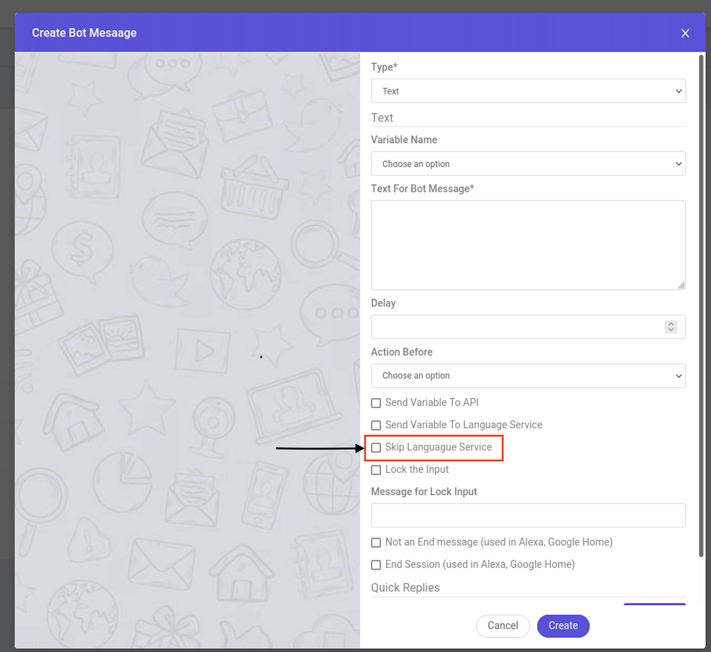

# **skipLS And Conditions On Button**

## Overview

In this doc, we will see 2 topics:-
* What is skipLS, what is its usage in bot building and how to use it?
* What are the conditions you can put on buttons in db, and how to use?


## **skipLS**
-----
**Definition** - skipLS is feature , which can disable the AI processing for that message response. i.e, For any message on which skipLS is true, whatever is its response, ocs will not send that response to AI. So, you can use that response at the backend and proceed the flow , in whatever way you want.

You guys can check the code in **processCustomerMessageOriginal** in *Brainservice.js* , under this condition 

```javascript
const processCustomerMessageOriginal = async function (socket, userData) {
.
.
.
   if (skipLS && !userData.preAnalyzedResponse) {
      // bot first message
      if(process.env.BOT_FIRST_MESSAGE && isNewSessionCreated && sendBotFirstMsg) {
        session_doc = await genAndSendResponse(socket, session_doc, 'response', process.env.BOT_FIRST_MESSAGE)
      }

      // console.log('skipLS do here');
      const entitiesToUpdate = userData.variable_name
        ? { [userData.variable_name]: userData.text }
        : {};
      let analysisRes = {
        intentName: 'None',
        statusCode: 200,
        entities: entitiesToUpdate,
      };
.
.
.

   }

```


You can enable/disable this feature from dashboard,while creating message and also in custom message doc.

```javascript
 		const custom_message_doc = {};
        custom_message_doc.type = 'text';
        custom_message_doc.skipLS = false; //boolean

```





------


## **Conditions On Button In DB**

 We use conditions to display/disable the button, we can use any condition on the buttons but all conditions have to be valid and the variables which we are using should exist in context variables , socket or session_doc.

 **How to Use-** We can use conditions on buttons by using a condition tag and then specifying the condition, when this button will be visible.

You guys can check the code in **processButtonsArray** in *socket-functions.js* , under this condition 

```javascript
async function processButtonsArray({buttons, session_doc, socket, globalFormatObject,
}) {
	.
	.
	if(buttons[i].condition && !eval(buttons[i].condition)){
              continue;
            }
	.
	.
}
```

For Example:- 

```javascript
	"buttons" : [
		{
			"condition" : "if(session_doc.context_variables.option && session_doc.context_variables.option == 'consultation' && (!session_doc.context_variables.language || session_doc.context_variables.language == 'EN')) {true} else {false}",
			"eventName" : "customSocketEvent",
			"type" : "customEventName",
			"text" : "cannot share"
		},
		{
            "condition" : "if(socket.channel==='whatsapp') {true} else {false}",
            "type" : "default",
            "text" : "Show more"
        }
	]
```

 In the above example, if condition becomes **TRUE** -> Button will be shown,

 Else For **False** --> it will not be shown.


    