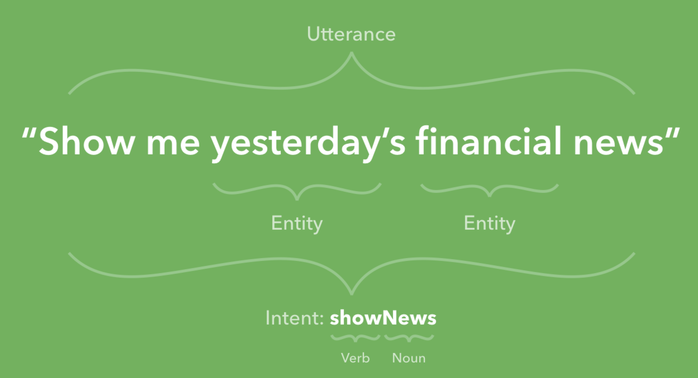

Understanding How user utterance is broken down into structured Information ```Intent & Entities``` to develop a bot



# Intents : Know what your users want


<figure class="video_container">
  <iframe width="560" height="315" src="https://www.youtube.com/embed/9aHusGxntPw" title="YouTube video player" frameborder="0" allow="accelerometer; autoplay; clipboard-write; encrypted-media; gyroscope; picture-in-picture" allowfullscreen></iframe>
</figure>


# Entities: Identify things your users mention


<figure class="video_container">
    <iframe width="560" height="315" src="https://www.youtube.com/embed/kzdL6GxJ_WY" title="YouTube video player" frameborder="0" allow="accelerometer; autoplay; clipboard-write; encrypted-media; gyroscope; picture-in-picture" allowfullscreen></iframe>
</figure>


# Dialog Control: Shape the flow of your conversation


<figure class="video_container">
    <iframe width="560" height="315" src="https://www.youtube.com/embed/-tOamKtmxdY" title="YouTube video player" frameborder="0" allow="accelerometer; autoplay; clipboard-write; encrypted-media; gyroscope; picture-in-picture" allowfullscreen></iframe>
</figure>
