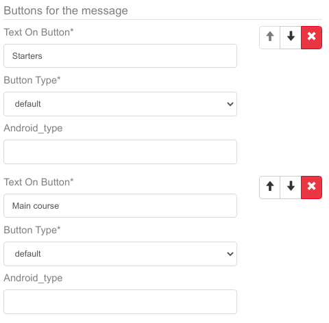
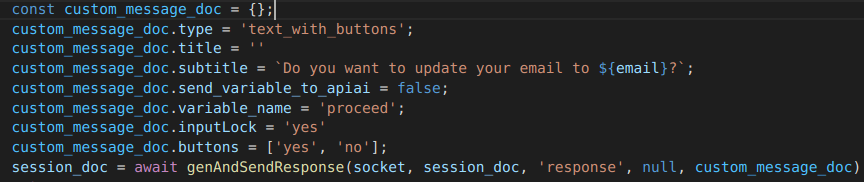
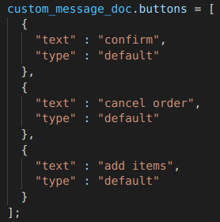
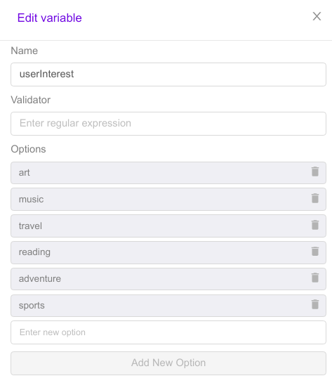
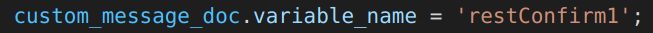

# Buttons and Variables

## Initializing buttons and variables

**Explanation**

Buttons and variables can be defined through ```dashboard``` as well as custom buttons and custom variables through ```custom_message_doc```

**Note** - All the buttons, variables and messages are stored in DB. 

Buttons are the integral part of a message, they are used for option selection or as a suggestion for the user.

Variables can be used to carry bot messages, functionality and for workflow movement. Variables used for workflow movement should be defined or created through **Dashboard** under ```Bot builder-> Bot Params```.
Variables assigned to a message can also be created through **custom_mesage_doc**.

Buttons defined through dashboard under ```Bot Builder->Bot Messages``` 



Custom buttons defined through ```custom_message_doc```

>

>


Variables defined through dashboard in ```Bot Builder->Bot Params```



Variables defined through ```custom_message_doc```

>

**```All Variables Must Be Defined In DB Before Use Except relayData variables of custom message```**
## Take User Input In Variable

**Explanation**

If you define a message with the attached variable , and when bot prints that message and in response whatever the user reply that will store that value to that variable , then you can validate and use it for processing and functioning.


## Take User Input Through Buttons 

**Explanation**

When a user taps on a button of the message, it assigns the text on the button to the variable assigned to that specific message. This variable is then stored into our DB with the assigned value.

**Note that** -  A variable assigned to a button can hold a string.


## Update Variable Value In DB
**Explanation**

For the proper functioning and workflow bot have to save variable data in Db.
This is the function which can stores value in DB ```  update_entities_in_db_without_check ```

And below is the sample code to update value of input_variable in DB 
```javascript
    session_doc = await update_entities_in_db_without_check(session_doc, {
        input_variable : value
    });
```

## Fetch Value Of Variable From DB
**Explanation**

To get the value from the session_doc , you can check in its context variables and fetch the value from there.

Like this- 
```javascript
   const input_variable = (session_doc.context_variables.input_variable)?session_doc.context_variables.input_variable:null;
```