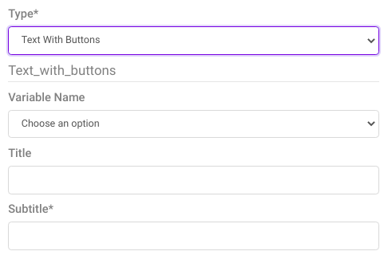
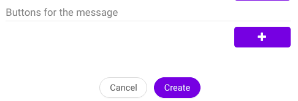
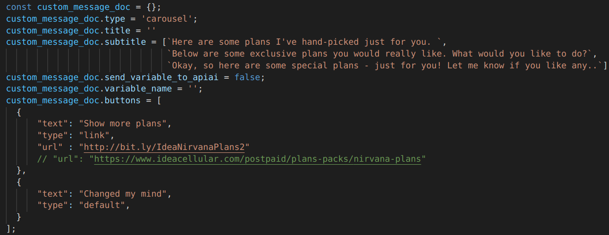

# Message creation

## Message definition and creation

**Explanation**

Bot messages can be defined under the **```Dashboard```** as well as can be made custom with the help of **```custom_message_doc```**

There are many types of message definitions namely -
* text
* text with buttons
* carousel
* Image with buttons
* video 
* timer
* custom message

### Creating message from **```Dashboard```**

>
>
>

### Creating message from **```custom_message_doc```** 

**Example of custom carousel message definition**

>

**Example snippet**

```javascript 
custom_message_doc.type = 'yourMessageType';
custom_message_doc.variable_name = 'yourVariableName'

        const displayMenu = [];
        const options = {
            "title" : `yourTitle`,
            "subtitle": 'yourSubtitle',
            "mediaType" : "image",
            "mediaUrl" : 'yourImageUrl',
            "buttons" : [
              {
                "text" : 'yourText',
                "type" : 'buttonType',
                "eventName" : "buttonSelection",
                "relayData" : {
                  'variable_name' : 'yourVariableValue',                 
                  }, 
                },
              },
            ]
        }
        displayMenu.push(options);

custom_message_doc.options = displayMenu;
```


**Explanation**

**Note** - Any variable inside relayData gets dynamically created when the user taps on that specified button.

* **Insider** - inside relayData multiple variable or objects can be passed for more dynamic functionality.

## Inserting message from DB

### Insertion from nosqlBooster

**Example snippet**

```mongodb
    db.getCollection("messages").insert({
        "updatedAt": ISODate("2021-05-12T14:05:06.934+05:30"),
        "createdAt": ISODate("2021-05-12T14:05:06.934+05:30"),
        "variable_name": "userEnteredQuantity",
        "send_variable_to_apiai": false,
        "skipLS": false,
        "inputLock": false,
        "progressiveMesssage": false,
        "shouldEndSession": false,
        "delay": NumberInt(0),
        "title": "Add your desired quantity",
        "subtitle": "due to high demand we are only limiting our order to maximum of 3",
        "type": "text_with_buttons",
        "usages": [],
        "options": [],
        "images": [],
        "quickReplies": [],
        "data": [],
        "accordion": [],
        "buttons": [
            {
                "type": "default",
                "text": "1"
            },
            {
                "type": "default",
                "text": "2"
            },
            {
                "type": "default",
                "text": "3"
            }
        ],
        "__v": NumberInt(0)
    })
```


