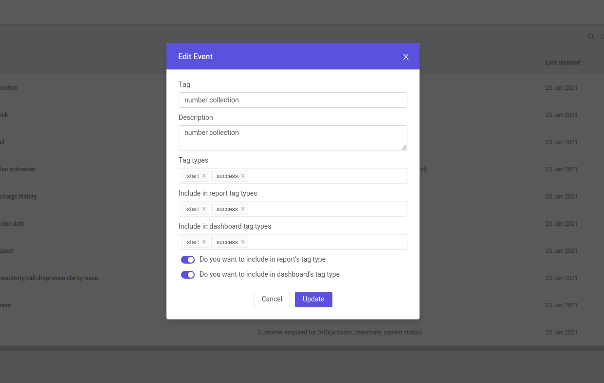
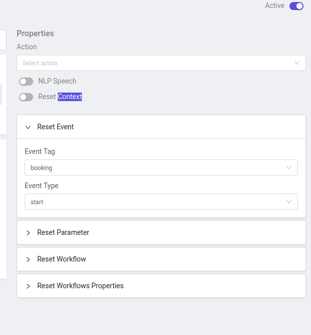
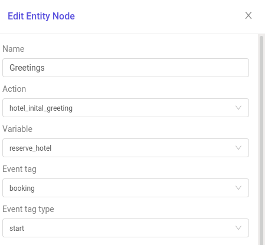
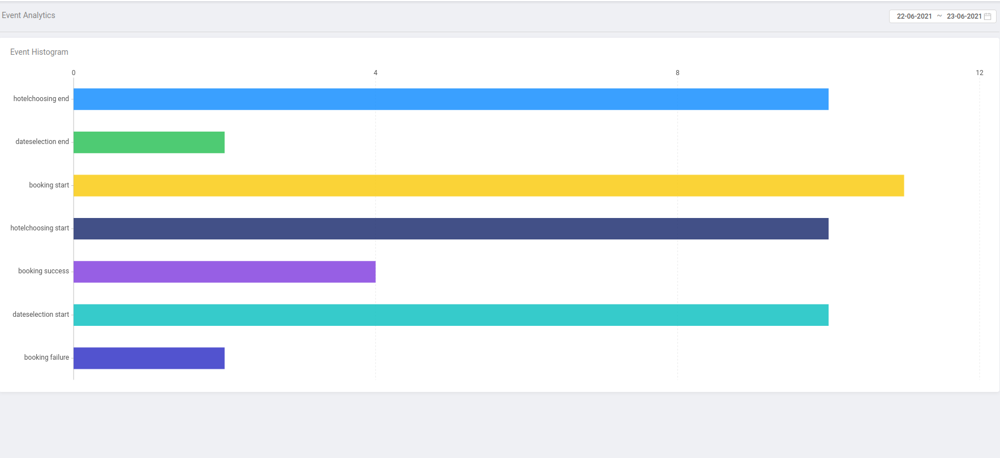

# Events

## Event definition and creation

**Explanation**

Events can give the summary of the conversation between bot and user to the assigned agent so agent doesn't have to read the whole conversation again.
Events have to be defined in **```Dashboard```** .

You can select tags and types of your events, and always turn on  two features if you want events to be ```tracked``` by dashboard.

>
**Note** - Whenever an event is created always check DB , if it is there then your is successfully created.


## How To Use Events  

 ### There Are 3 Ways To Use Events In Bot -
* #### By Intents 
* #### By Workflows
* #### By code


### Using Events By  **```Intents```**

When you define intent make sure you select the right event tag and type in the **```Reset Event```** section to trigger that event.

Like in this case, tag is booking and type is start.

>


### Using Events By  **```Workflow Nodes```**

When you define nodes in the workflow make sure to mention the event tag and type in the **``` Event tag and Event tag type ```** section to trigger that event.

Like in this case, tag is booking and type is start.

>


### Using Events By  **```CODE ```**

To use events by code , there is a function which you have to use which is **```update_tags_in_db ```** in your code. And to run this function you have to include it in your file like this .
 ```javascript 
const update_tags_in_db = require('../../helpers/database-functions').update_tags_in_db; 
```


>Sample code of **``` update_tags_in_db ```**
in which tag **```number collection```** have type as **```success```**.  
```javascript
update_tags_in_db(session_doc, { 
  type: 'success', tag: 'number collection', level: 'custom', description: `number collected`,});
```


## Event Analysis From **``` Dashboard ```** 
***You can always analyse the events from the dashboard***


Every Event which is triggered will reflect its values here. 

>