# Food ordering through chatbot

## Overview and Approach

### Overview

The idea behind this project is to let customer see menu of different cuisines he/she can choose from and do the same multiple times for different dish items.

* Customer should see the main menu.
* A submenu for dishes.
* Quantity for every item that a customer can order.
* Dynamic menu display after every selection of item.
* A confirmation page with all the listing of items.
* Cancelling, Confirming or adding more items in the order.

**Enhancement** - Adding modifying the order at any point of workflow.

------

### Approach

Make a rough workflow of your project, how it will function, a node will point to which node.

State the methods at every node to perform some actions or functionality.

Define the variables required for the workflow to move further.

Define messages to be delivered at every node for the workflow.

Attach variables logically with the messages whenever required.

Define your use cases and logic behind every method to function properly.

You can do this roughly through pen and paper or any comofortable tool.

Test your functionality and logics and finalize the workflow.

Go to Bot Builder and start with the project.

## **```TRY BUILDING IT YOURSELF BEFORE```**

------
## Use case

* Initializing the workflow by greeting
* Main menu display to choose between different cuisines.
* Displaying SubMenu for the appropriate selected Menu.
* Displaying quantity for the selected dish.
* User can go back to previous menu from anywhere.
* Displaying order confirmation, cancel or adding more item.
* Confirming will finalize the workflow and set it to end node.
* Cancelling can move the workflow to start again.
* adding items can show Menu again.

------
## Workflow

Main workflow for reference

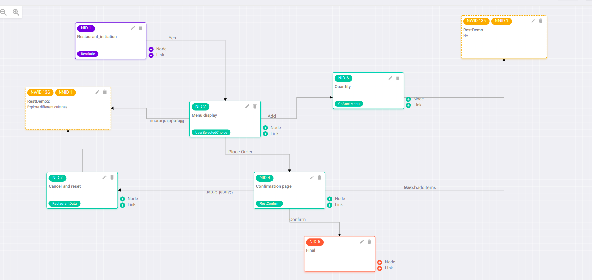


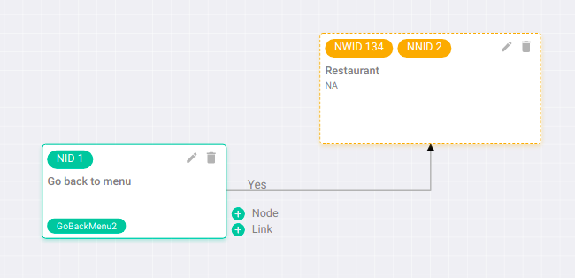

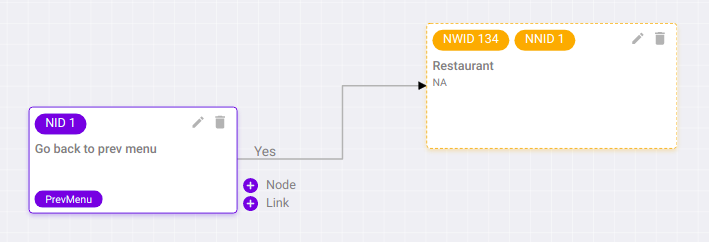


------
## Function or Method

Functions or Methods used for this workflow -

### **For references** 

**Head to branch ```demoDaksh```**

**File name - ```../ori-communication-service/BrainService/brand-files/actions/brand-actions.js```** 

-------

* **Greeting function** [function name - **```restaurantFunc```**]
    * To display the greeting message with Main Menu display.
     
     ```javascript
    const restaurantFunc = async (socket, session_doc, node_doc, action_parameter, ongoing_intent_doc, callback) =>{
        .
        .
        .
    }
    ``` 

    > 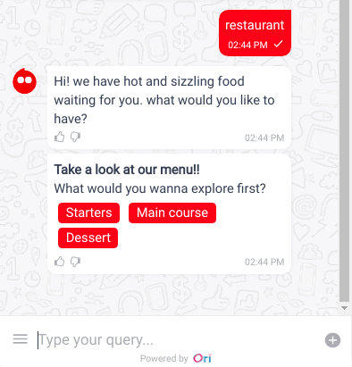

------------

* **Menu display function** [function name - **```restMenuDisplay```**]
 
    * To display dynamic message for the SubMenu depending upon the selected choice of user.
     
     ```javascript
    const restMenuDisplay = async (socket, session_doc, node_doc, action_parameter, ongoing_intent_doc, callback) =>{
        .
        .
        .
    }
    ```  

    > 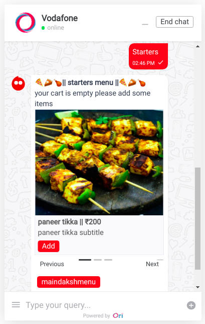

--------

* **Quantity display function** [function name - **```restQuantityDisplay```**]

    * To display the quantity of the selected item to further calculation of the total amount.
     
    ```javascript
    const restQuantityDisplay = async (socket, session_doc, node_doc, action_parameter, ongoing_intent_doc, callback) =>{
        .
        .
        .
    }
    ``` 

    > 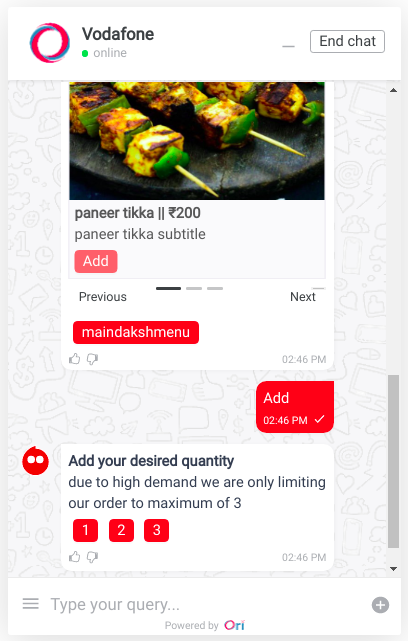

---------

* **Calculate total amount function** [function name - **```restCalcTotalAmount```**]
    * After getting the quantity of the selected order, calculating the total amount.
     
    * Further displaying the Menu again to choose the next item.
     
     ```javascript
    const restCalcTotalAmount = async (socket, session_doc, node_doc, action_parameter, ongoing_intent_doc, callback) =>{
        .
        .
        .
    }
    ``` 

    > 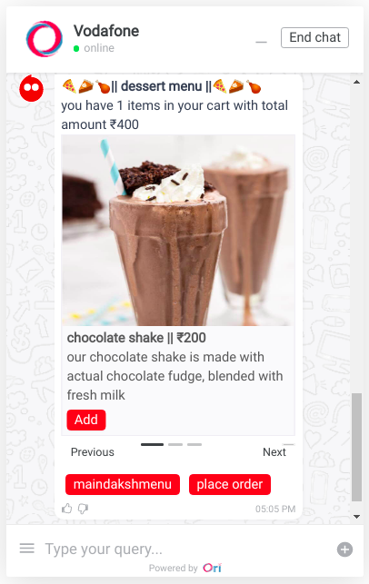 

-------------

* **Previous Menu display function** [function name - **```restPrevMenu```**]
  
    * To let the user go back to choose different cuisines from the already displaying SubMenu.
  
    * Further dynamic display of SubMenu from choosing the cuisine.
  
     ```javascript
    const restPrevMenu = async (socket, session_doc, node_doc, action_parameter, ongoing_intent_doc, callback) =>{
        .
        .
        .
    }
    ``` 

    > 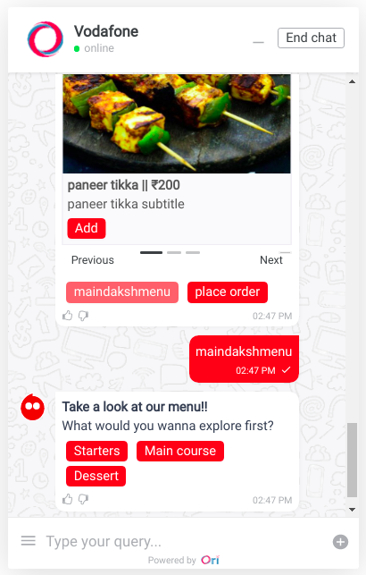


-----------

* **Confirm order function** [function name - **```restConfirmOrder```**]

    * To display the total items with total amount.
  
    * Confirm, cancel order or Add more items in the cart.
     
     ```javascript
    const restConfirmOrder = async (socket, session_doc, node_doc, action_parameter, ongoing_intent_doc, callback) =>{
        .
        .
        .
    }
    ``` 

    > 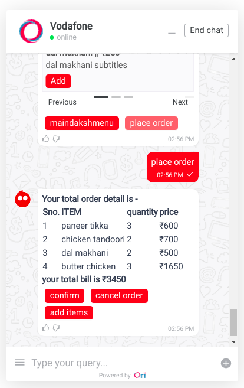


-----------

* **Add Items function** [function name - **```restCalcTotalAmount```**]

  * To display the Menu again for adding more items.
  
    ```javascript
    const restCalcTotalAmount = async (socket, session_doc, node_doc, action_parameter, ongoing_intent_doc, callback) =>{
        .
        .
        .
    }
    ``` 

    > 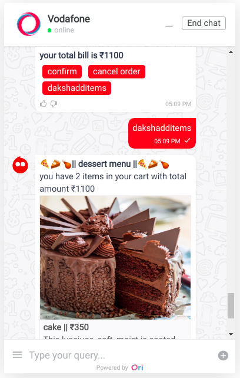 

--------------


* **Final function** [function name - **```restFinalFunc```**]

  * To Confirm the order and displaying the Thankyou message.

    ```javascript
    const restFinalFunc = async (socket, session_doc, node_doc, action_parameter, ongoing_intent_doc, callback) =>{
        .
        .
        .
    }
    ``` 

    > 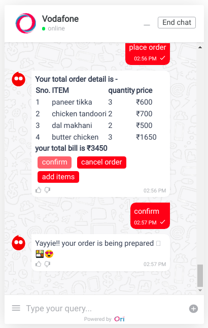 


------------

* **Cancel order function** [function name - **```restCancelReset```**]
    * To cancel all the items and sending the workflow to the initial node.

     ```javascript
    const restCancelReset = async (socket, session_doc, node_doc, action_parameter, ongoing_intent_doc, callback) =>{
        .
        .
        .
    }
    ``` 

    > 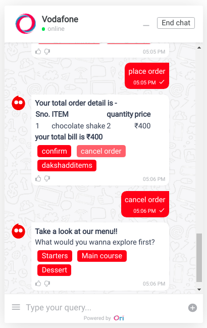 

------------------

## Variables 

* **restRule**
  * To get the selected cuisine and further show the SubMenu listing.
* **userSelectedChoice**
  * Can get the selected choice of the item.
  * Can place order and move further with confiramtion.
  * Can go back to previous Menu.
* **goBackMenu**
  * To get the quantity, calculate the amount and send the workflow back to the selected choice SubMenu.
* **restConfirm**
  * Can confirm the order.
  * Can cancel the order and sends the workflow to reset the restaurant data.
  * Can Add more items and sends the workflow back to the Menu display.
* **restaurantData**
  * Cancelling the order, further moving the workflow back to main Menu.
  
-----

## **```ENHANCEMENT FOR FUTURE``` - Modifying the order and removing items from the confirmed order.**