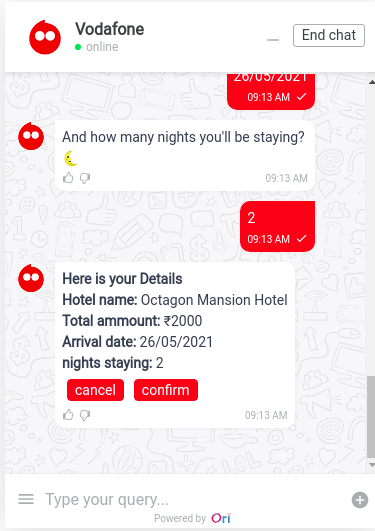

## Overview and Approach
### Overview

Hotel Reservation bot helps customer to see variety of different hotels they can opt from and it takes the reservation details to confirm the booking in that particular hotel

* Customer should see the main menu.
* A submenu for different Hotels.
* Enter reservation details like no. of nights staying,arrival date etc.
* validation on arrival date.
* A confirmation page with all the reservation details.
* Cancelling, Confirming the reservation.

### Approach

Make a rough workflow of your project, how it will function, a node will point to which node.

State the methods at every node to perform some actions or functionality.

Define the variables required for the workflow to move further.

Define messages to be delivered at every node for the workflow.

Attach variables logically with the messages whenever required.

Define your use cases and logic behind every method to function properly.

You can do this roughly through pen and paper or any comofortable tool.

Test your functionality and logics and finalize the workflow.

Go to Bot Builder and start with the project.

## **```TRY BUILDING IT YOURSELF BEFORE```**

## Use case

* Initializing the workflow by greeting
* Main menu display to choose between different Hotels
* Take the check in details for reservation .
* validate the arrival date
* calculate the total bill based on the hotel choosed and the no. of nights staying
* Displaying Reservation confirmation or cancel
* Confirming will finalize the workflow and set it to end node.
* Cancelling can move the workflow to start again.


## Workflow

Main workflow for reference


## Function or Method

### **For references** 

**Head to branch ```demoMayank```**

**File name - ```../ori-communication-service/BrainService/brand-files/actions/demoMayank.js```** 

---------
Functions or Methods used for this workflow -

* greeting function [function name - **```hotel_intial```**]
    * To display the greeting message.

    > 

* Menu display function [function name - **```select_type```**]
    * To display dynamic message for the SubMenu

    > 

* check In detail function [function name - **```checkIn_detail```**]
     * To take check in details like arrival date and nights staying 

     > 
     
* validate Arrival date funtion [function name - **```validateDate```**]
    * validate the arrival date using Regular expression and also the date should be    greater then today's date    

    ```javascript
    function validateDate(date)
    {
        var dateRegx = /^([0-2][0-9]|(3)[0-1])(\/)(((0)[0-9])|((1)[0-2]))(\/)\d{4}$/i;
        var dateResult = dateRegx.test(date);
        var res = date.split("/");
        var inp_date = new Date(`${res[2]}-${res[1]}-${res[0]}`);
        var todayDate = new Date(); 

        if(inp_date>todayDate && dateResult) return true;
        else return false;
    }
    ```
    >If user enter date in wrong format then again show him message to show it in correct format

    
   

* Total Bill function [function name - **```total_bill```**]
    * Based on the no. of nights staying and the property choosen by the person (each having different price) genrate the total bill with all required details

    > 

* Final function  [function name - **```confirm_reg```**] 
  * If person Confirm the reservation then display the Thankyou message.

  > 

* Cancel Reservation function [function name - **```cancel_reg```**]
    * Reset all the node variable and other data variable so that user can again make   reservation.
    
## Variables 

* **hotel_reservation**
  * To know if user want to make reservation.
* **hotel_type**
  * get the selected choice of hotel.

* **check_in**
  * To get the check In detail 

* **regestration**
  * Can confirm the reservation and send it to final node.
  * Can cancel the reservation and sends it to the cancel regestration node.
## ENHANCEMENT FOR FUTURE 
* cancelling reservation at any point of workflow.
* can Edit reservation details after reservation is done.